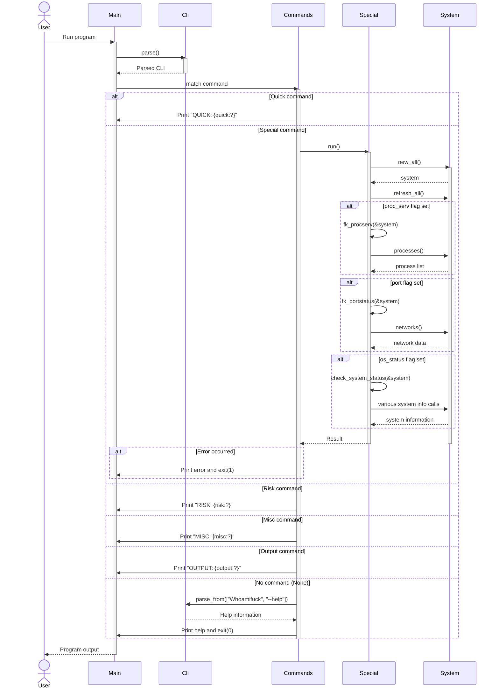

# Whoamifuck

Whoamifuck 是 zhuima 的第一个 `Rust` 命令行开源工具。这是一个最初由 Shell 编写的用于检测入侵者的工具，本人使用Rust复刻了 Shell 版的完整的功能。

本仓库是`Rust`版本，Shell 版请参考[原版](https://github.com/enomothem/Whoamifuck)

## 功能特点

- 快速命令用于基本操作
- 特殊命令用于高级操作
- 风险评估命令
- 杂项命令用于各种任务
- 输出命令用于生成报告

## 安装

首先，确保您的系统上安装了 Rust。如果没有，请访问 [Rust 官网](https://www.rust-lang.org/) 进行安装。

然后，克隆此仓库并编译项目：

```bash
git clone https://github.com/your-username/whoamifuck.git
cd whoamifuck
cargo build --release
```


## 程序流程图

以下是 Whoamifuck 主要程序流程的时序图：




## 使用指南

Whoamifuck 使用 Clap 库来构建命令行界面。以下是主要命令的使用方法：

### 快速命令 (QUICK)

用于基本操作：

```bash
./whoamifuck QUICK --user-device <设备名> --login <登录名> [--nomal] [--all]
```


- `--user-device`：用户设备名称
- `--login`：用户登录名（默认值：`/var/log/secure;/var/log/auth.log`）
- `--nomal`：基本输出
- `--all`：完整输出

### 特殊命令 (SPECIAL)

用于高级操作：

```bash
./whoamifuck SPECIAL --user-device <设备名> --login <登录名> [--nomal] [--all]
```


- `--proc-serv`：检查用户进程和服务状态
- `--port`：检查用户端口开放状态
- `--os-status`：检查系统状态信息

### 风险评估命令 (RISK)

```bash
./whoamifuck RISK --user-device <设备名> --login <登录名> [--nomal] [--all]
```


- `--baseline`：安全基线检查
- `--risk`：检查系统漏洞信息
- `--rootkitcheck`：检查系统 rootkit 信息
- `--webshell`：检查 Web shell 信息（默认值：`/var/www/;/www/wwwroot/..`）

### 杂项命令 (MISC)

```bash
./whoamifuck MISC --user-device <设备名> --login <登录名> [--nomal] [--all]
```


- `--code`：检查页面存活状态
- `--sqletlog`：检查用户信息
- `--auto-run`：设置 crontab 信息
- `--ext`：自定义命令定义测试（默认值：`~/.whok/chief-inspector.conf`）

### 输出命令 (OUTPUT)


```bash
./whoamifuck OUTPUT --user-device <设备名> --login <登录名> [--nomal] [--all]
```


- `--output`：输出到文件
- `--html`：输出到终端（HTML 格式）

## 示例

检查用户登录信息并输出基本信息：

```bash
./whoamifuck QUICK --user-device "服务器" --login "root" --nomal
```


进行安全基线检查并生成 HTML 报告：


```bash
./whoamifuck OUTPUT --user-device "服务器" --login "root" --html
```


## 贡献

欢迎提交 Pull Requests 来改进这个工具。在提交之前，请确保您的代码符合项目的编码规范并通过所有测试。

## 许可证

MIT

## 联系方式

zhuima314@gmail.com

## 参考资料

- [Clap 文档, 案例一](https://mp.weixin.qq.com/s/XXqpHSO9jXBUUv5sJbOAbg)
- [Clap 文档, 案例二](https://mp.weixin.qq.com/s/QJPq7pEvxzeYsL5U9W_CyA)
- [Clap 文档, 案例三](https://mp.weixin.qq.com/s/ZjV31-zaO_3OWzwoT1gjjg)
- [Clap 文档, 案例四](https://mp.weixin.qq.com/s/ZjV31-zaO_3OWzwoT1gjjg)


